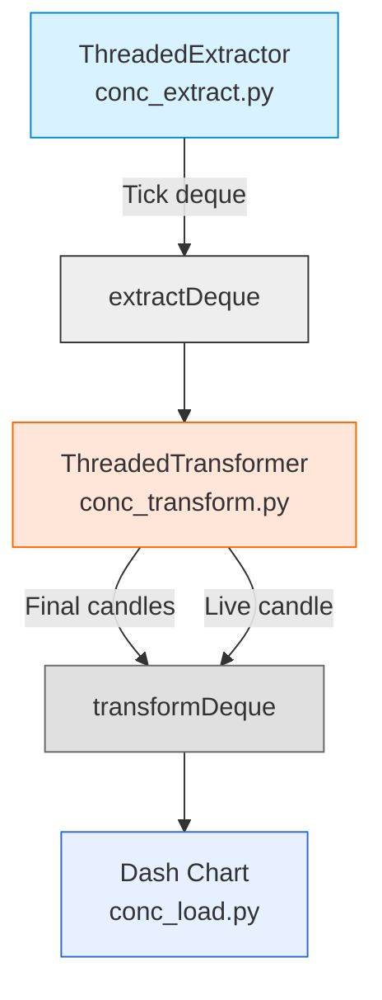
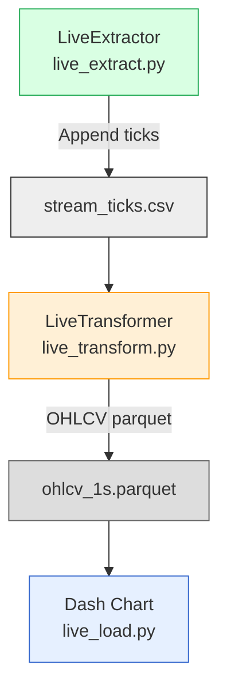

# Market Data ETL  (Multi‑Threaded + Sequential Versions)

A lightweight market‑data simulator and ETL pipeline supporting **two fully implemented workflows**:

- **Multi‑Threaded Version (Real‑time)** – generates live ticks every millisecond using threads, builds current candle and closed 1‑second OHLCV candles, and streams updates to Dash.
- **Sequential Version (File‑based)** – simulates ticks to CSV, aggregates them into OHLCV, writes them to Parquet files, and visualizes them in Dash.

# To Run

`pip install -r requirements.txt`

In a browser open:
`http://127.0.0.1:8050/`

Then in the terminal run it for 100 seconds with:
`python3 multiThreadedConcurrent/main.py --duration 100`


# Multi‑Threaded Version (Real-Time Pipeline)

The multi‑threaded system runs **three threads**:
- `ThreadedExtractor` → produces tick data **every millisecond** , appends to extractDeque
- `ThreadedTransformer` → consumes ticks from extractDeque and builds 1‑second OHLCV candles, append to transformDeque
-  `Main thread` -> updates Dash plot from transformDeque

### **Real-Time Flow**


### **What This Version Does**
✔ Spawns live tick generator (random normal (Gaussian) price changes)  
✔ Pushes data into a shared lock-free deques 
✔ Aggregates ticks into 1‑second candles  
✔ Maintains a partial “in‑progress” candle  
✔ Streams OHLCV and volume to a Dash app in real time


---
#  Sequential Version (CSV → OHLCV → Parquet → Dash)

This pipeline runs **sequentially** without threads.

### **Data Flow (Sequential)**


### **What This Version Does**
✔ Simulates ticks every `interval` seconds or reads from yfinance 
✔ Appends data to `stream_ticks.csv`  
✔ Aggregates ticks into OHLCV using pandas `.resample()`  
✔ Saves output as Parquet file  
✔ Dash reads the parquet and plots bars


---
#  Module-by-Module Breakdown
## **Multi-Threaded version**

### conc_extract.py – ThreadedExtractor
- Generates random tick data
- Supports multiple tickers
- Pushes tick dicts into `extractDeque` every **millisecond**
- Output format:
```
{
  "Timestamp": datetime,
  "Ticker": str,
  "Price": float,
  "Volume": int
}
```

### conc_transform.py – ThreadedTransformer
- Consumes ticks from `extractDeque`
- Aggregates all millisecond data and builds 1‑second OHLCV bars
- Maintains:
  - currentCandle
	  - updates every millisecond
  - `transformDeque` (finalized candles)
	  - appends to it at the end of the second
- Ouput format:
```
{
  "Timestamp": datetime,
  "open": float,
  "high": float,
  "low": float,
  "close": float,
  "Volume": int
}
```

### conc_load.py – Live Dash Renderer
- Reads both `transformDeque` and the in-progress candle
- Plots:
  - Candlestick chart
  - Volume bars
- Updates every 150 ms (bottleneck)

---
## **Sequential version**

### live_extract.py – Sequential Tick Streamer
- Writes random ticks to CSV
- Output file: `data/raw/stream_ticks.csv`

### live_transform.py – CSV → OHLCV Aggregation
- Uses pandas resampling to produce OHLCV
- Output file: `data/processed/ohlcv_1s.parquet`

### live_load.py – Parquet Viewer (Dash)
- Loads parquet file
- Displays data for ticker `NVDA`
- Candlestick + volume
